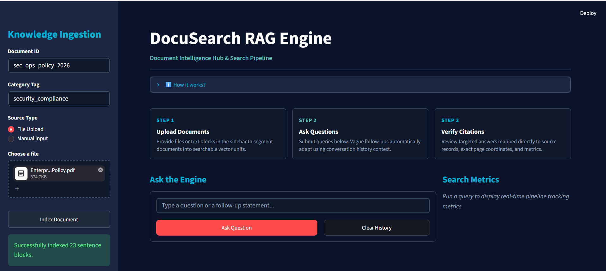

# DocuSearch: Conversational RAG Engine

DocuSearch is a conversational document search assistant powered by a Retrieval-Augmented Generation (RAG) pipeline. It indexes multi-page documents into a vector database for semantic search and utilizes the Gemini LLM to generate answers backed by precise page citations.

---

## Key Features
* Semantic Search: Embeds and stores sentence-level chunks using a local ChromaDB vector storage setup.
* Contextual History: Automatically rewrites follow-up queries using chat history for seamless conversation.
* UI Analytics: Interactive Streamlit dashboard displaying real-time match quality metrics and source tracking badges.
* Decoupled Architecture: Dual-service layout leveraging a high-performance FastAPI backend.

---

## System Walkthrough

### 1. Document Ingestion Pipeline
The sidebar processes multi-page uploads or text input, parsing the text into semantic sentence chunks before securely committing them to local vector storage.

### 2. Conversational Q&A and Verification
Submitting a query triggers vector database retrieval, bringing back high-purity text context, confidence scores, and strict page location data alongside the generated answer.

---

## Repository File Structure
* app.py - Streamlit frontend web dashboard.
* main.py - FastAPI backend orchestrator and database controller.
* chunker.py - Text processing engine for sentence splitting.
* llm_service.py - Gemini API connector for query rewriting and response synthesis.
* requirements.txt - App dependencies.
* .gitignore - Protects local database caches (chroma_storage/) and private secrets (.env).

---

## Quick Start

### 1. Setup Environment
Command: git clone https://github.com/SinghAniket24/docusearch-rag-engine.git
Command: cd docusearch-rag-engine
Command: pip install -r requirements.txt

### 2. Configure Credentials
Create a .env file  in the project root:
Line to add: GEMINI_API_KEY=your_actual_api_key_here

### 3. Execution
Launch the microservices in two separate terminals:
* Backend: uvicorn main:app --reload
* Frontend: streamlit run app.py

---

## Verification
1. Upload a multi-page document via the Streamlit sidebar using a unique Document ID.
2. Click Index Document to commit semantic vector blocks to ChromaDB.
3. Submit a query in the chat console to review the generated answer along with its quantitative Match Quality score and Page Citation badge.
